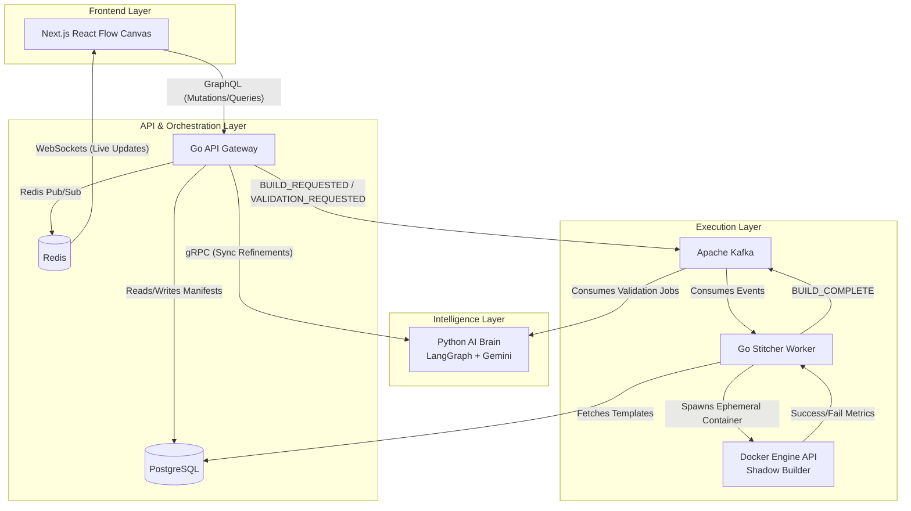

# Archon : Architect-to-Code Engine
[](https://github.com/kisna/Archon/actions/workflows/integration-tests.yml)
> An AI-driven, event-based distributed orchestrator that transforms natural language requirements into production-ready, validated architectures.

## 📖 Overview

The **Architect-to-Code Engine** moves beyond generic SaaS templates. It is a distributed developer platform that acts as an automated Principal Engineer. Users describe their project requirements, and the system's AI Brain architects a custom `project_manifest.json`. The backend then stitches together pre-verified "Atomic Lego Bricks" (Auth, DB, Messaging, Observability) and runs an ephemeral "Shadow Build" to guarantee the code is production-ready before delivery.

## ✨ Core Capabilities

* **AI-Driven Architectural Validation:** Leverages LangGraph and Gemini to prune bad architectural decisions and suggest optimal tech stacks.
* **Idempotent Code Stitching:** Assembles discrete, pre-tested code modules based on a strict deterministic manifest.
* **Shadow Build Pipeline:** Spawns isolated Docker containers to test-compile the generated codebase, ensuring zero broken deliveries.
* **Real-Time Visual Canvas:** Streams state mutations from the AI Brain directly to a React Flow UI via WebSockets for instant user feedback.
* **Contract-First Communication:** Enforces strict internal schemas using gRPC and Protocol Buffers between polyglot services (Go & Python).

---

## 🏛️ System Architecture

The platform is built on a **Distributed Event-Driven Microservices** architecture, separating the high-latency reasoning of the AI from the high-throughput execution of code generation.

### Architecture Diagram



### 🧩 Service Breakdown

#### 1. The API Gateway (Go / Golang)
The traffic cop and state manager. It exposes a **GraphQL** endpoint for the frontend, manages user authentication, and coordinates state. It uses **Redis Pub/Sub** to push architectural updates to the user's WebSocket connection in real time.

#### 2. The AI Brain (Python)
The reasoning engine powered by **LangGraph**. It exposes both a **gRPC Server** (for fast, synchronous manifest refinements) and a **Kafka Consumer** (for slow, asynchronous architectural audits). It safely mutates the `project_manifest.json` schema without ever writing raw code.

#### 3. The Stitcher & Shadow Builder (Go / Golang)
The asynchronous execution worker. It listens to **Apache Kafka** for build requests. Once triggered, it pulls "Lego Bricks" from the Atomic Library, injects variables, and utilizes the **Docker Engine API** to run a sandboxed test build. Failed builds are routed to a Dead Letter Queue (DLQ) for debugging.

#### 4. The Atomic Library (PostgreSQL + S3)
A highly curated registry of production-grade modules (e.g., gRPC templates, Auth flows, Kafka consumers). The metadata (`index.json`) is queried by the Stitcher to understand dependencies and entry points before assembly.

---

## 🔄 Data Lifecycle & Flow

### 1. The Ideation Loop (Low Latency)
When a user requests a change (e.g., *"Swap standard Postgres for TimescaleDB"*):
1. The frontend fires a GraphQL mutation to the Go Gateway.
2. The Gateway makes a sync `gRPC` call to the Python AI Brain.
3. The AI Brain validates the schema constraint and updates the manifest.
4. The Gateway saves the new state to Postgres and pushes an event to Redis.
5. The UI canvas updates instantly via WebSockets.

### 2. The Validation Loop (Async)
When a user requests a deep audit (e.g., *"Audit for security flaws"*):
1. The Gateway publishes a `VALIDATION_REQUESTED` event to Kafka.
2. The AI Brain consumes the event, processes the architecture, and publishes a `VALIDATION_COMPLETE` event.
3. The Gateway reads the result and updates the user's live session.

### 3. The Execution Loop (High Compute)
When the user clicks "Ship":
1. The Gateway pushes a `BUILD_REQUESTED` event to Kafka.
2. The Go Stitcher consumes the event and begins deterministic file assembly.
3. The Stitcher spawns an isolated Docker container with strict CPU/Memory limits.
4. If the build succeeds, the system pushes the artifact to a target repository and fires a `BUILD_COMPLETE` event. If it fails, it triggers a retry loop before falling back to the DLQ.

---

## 🛠️ Technology Stack

| Domain | Technology | Purpose |
| :--- | :--- | :--- |
| **Frontend** | Next.js, React Flow, Apollo | Drag-and-drop canvas and real-time state visualization. |
| **Gateway / Orchestration**| Go, GraphQL (gqlgen) | High-concurrency traffic management and API routing. |
| **Intelligence** | Python, LangGraph, Gemini | Stateful AI conversation graphs and schema validation. |
| **Execution** | Go, Docker API | File templating and ephemeral sandboxed container builds. |
| **Event Bus** | Apache Kafka | Durable task queues, async jobs, and Dead Letter Queues. |
| **State / Cache** | PostgreSQL, Redis | Persistent manifest storage and WebSocket Pub/Sub state. |
| **Internal RPC** | gRPC (Protocol Buffers) | Type-safe, low-latency inter-service communication. |
| **Observability** | OpenTelemetry, Jaeger | Distributed tracing across Go, Python, and Kafka boundaries. |

[](https://github.com/kisna/Archon/actions/workflows/integration-tests.yml)

## 🧪 Testing

The project includes a comprehensive integration test suite that verifies every service boundary (GraphQL → gRPC → Kafka → Docker) using real infrastructure (Postgres, Redis, Kafka, Jaeger). All tests run automatically on every push and pull request via GitHub Actions.

### Running tests locally

**Unit tests** (fast, no external dependencies):
```bash
make test-unit
```

**Integration tests** (requires `docker-compose up -d` and all services):
```bash
make test-integration
```

**Everything** (unit + integration):
```bash
make test-all
```

The integration suite covers 8 layers:

| Layer | Scope | Tests |
|-------|-------|-------|
| 1 | Infrastructure connectivity | 4 |
| 2 | Database (PostgreSQL) | 5 |
| 3 | gRPC contracts (AI Brain) | 5 |
| 4 | GraphQL API | 4 |
| 5 | Kafka event pipeline | 4 |
| 6 | WebSocket / Redis Pub‑Sub | 3 |
| 7 | Shadow Builder (Docker) | 4 |
| 8 | End‑to‑end smoke test | 1 |
| **Total** | | **30** |

All tests pass with a mock LLM (set `GEMINI_MODEL=mock` before starting the AI Brain), ensuring no real API calls during CI.

---

Now your README shows live build status and tells contributors exactly how to replicate the full test suite locally. Need anything else?
